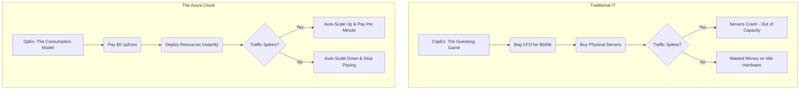

# ⚡ Sector 1.1: AZ-900 - Core Cloud Concepts

Welcome to Sector 1. If you read the official Microsoft documentation for AZ-900, you will probably fall asleep at your keyboard. It's written by lawyers and marketers. 

We don't do that here. You are going to learn what these concepts actually mean when you are sitting in an architecture meeting with a CIO who is screaming about the IT budget. 

Let's strip away the corporate fluff and talk about how the cloud actually operates.

---

## 🏗️ The Cloud Models (Where does your stuff live?)

"The Cloud" is just a fancy term for renting someone else's computer. But *how* you rent it matters.

* **Public Cloud:** You are renting space in Microsoft's massive, multi-billion-dollar data centers. You share the physical hardware with other companies (securely separated, of course). You pay zero upfront costs and scale infinitely. 
* **Private Cloud:** You own the servers. You own the data center. You own the cooling bills, the hardware failures, and the 3:00 AM pager alerts when a hard drive dies. *Why do this?* Usually for extreme legal, medical, or government compliance reasons.
* **Hybrid Cloud:** The messy reality of the modern enterprise. You keep your legacy, sensitive database on your Private Cloud, but you run your web front-end in the Public Cloud. 

## 💰 The Money: CapEx vs. OpEx

If you want to survive as a Cloud Architect, you have to understand how businesses spend money. The entire reason the cloud took over the world is because it changed the accounting model.

* **Capital Expenditure (CapEx):** The old way. You guess how much server capacity you will need for the next 5 years, beg the CFO for $500,000 upfront to buy the hardware, and watch it slowly become obsolete. 
* **Operational Expenditure (OpEx):** The cloud way. You don't buy the server; you rent it by the minute. It is a "consumption-based" model. If a marketing campaign goes viral, you scale up and pay more. If traffic dies, you scale down and pay less. 

### Visualizing the Financial Shift



> 💡 **BBAG PRO TIP:** Why do executives care so much about OpEx? Because it shifts risk. With CapEx, if a project fails, you are stuck with $500,000 of useless Dell servers sitting in a closet. With OpEx, if a project fails, you just run a terraform destroy command, nuke the environment, and stop the billing instantly. You are literally engineering financial safety.

---

## 🍕 The Shared Responsibility Model (IaaS vs. PaaS vs. SaaS)

When you move to Azure, you and Microsoft split the chores. What you are responsible for depends on the service model you choose. 

Think of this like "Pizza as a Service":
* **On-Premises (Private Cloud):** You make the dough, buy the cheese, bake it in your own oven, and serve it at your own table. You do everything.
* **IaaS (Infrastructure as a Service):** *Example: Azure Virtual Machines.* Microsoft gives you the raw compute, storage, and networking. **You** are still responsible for installing the Operating System, patching it, and keeping the hackers out. (Like buying a frozen pizza and baking it at home).
* **PaaS (Platform as a Service):** *Example: Azure App Service.* Microsoft handles the physical servers AND the Operating System. **You** just bring your application code and your data. (Like getting a pizza delivered to your door).
* **SaaS (Software as a Service):** *Example: Microsoft 365.* You don't manage anything but your users and data. Microsoft hosts the entire application. (Like eating at a pizzeria).

---

## 🛠️ THE RECON LAB: See the Cloud via CLI

Standard courses will now tell you to log into the Azure Portal and click around to look at regions. We don't do "Click-Ops." We use code. 

Let's prove that the cloud is just a massive global network by querying Microsoft's live data centers directly from your terminal.

**Mission:** Interrogate the Azure API to list every physical region where you can deploy infrastructure.

### Execution Steps:
1. Open this repository in your **GitHub Codespace**.
2. Wait for the `.devcontainer` to finish building your environment.
3. Once your bash terminal is ready, run the following Azure CLI command to query the global regions and format the output as a clean table:

```bash
az account list-locations -o table
```

**What just happened?**
You bypassed the web browser entirely. You used the Azure Command Line Interface (CLI) to ping Microsoft's global API, which returned a list of every single physical data center (East US, West Europe, Japan East, etc.) where you can spin up resources. 

Get used to this terminal. You are going to live here. 

[➡️ Next Module: Azure Architecture & Global Infrastructure](./Module-02-Architecture.md)
